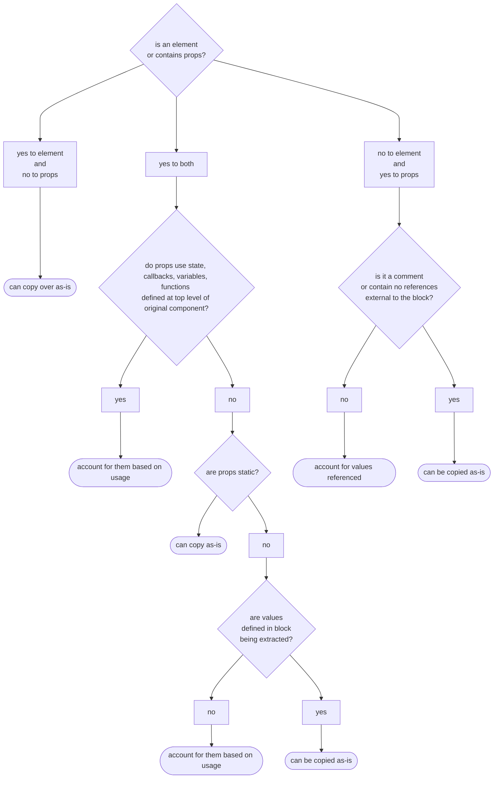

## Discussion Topics

### Reusable Components

Components are one of the fundamental building blocks of any React application. One of their main strengths is reusability. By writing components once and instantiating them as needed, we can streamline development and improve code maintainability. Certain elements in a UI tend to repeat themselves. These repeated elements might look same but contain different content. Conversely, they may have slightly different appearances but are structurally similar. These include:

- [ ] article excerpts on a blog's home page
- [ ] product cards
- [ ] list items
- [ ] day boxes in a calendar

We have already seen a few examples of repeated elements in CTD Swag. The blurred out product cards and the shopping cart items are both elements that repeat themselves. In fact, we've already had some experience with the card components. The shopping cart items are a prime example of an element that can be turned into a re-usable component. Inside of the `Cart` component, we map over the `workingCart` to create each list item. Rather than housing the code in `Cart` component, it can be extracted out to a `CartItem` component. Doing so saves space in the existing component file plus make it easier to read.


Another category of reusable components are elements that are used throughout an interface that allow user to navigate or interact with the page. They can also be visual details that unify the look and feel of an interface. Such components could include:

- [ ] buttons
- [ ] tooltips
- [ ] dialog boxes
- [ ] navigation menus
- [ ] forms

Any visual element is a candidate to become a reusable component as long as 2 criteria are met. 1.) They accept the same props and 2.) they have the same underlying structure. If we also take advantage of default props values and children props, we can further increase opportunities for creating re-usable components. Lets step away from CTD Swag to examine a `Dialog` component to see how we can make it into a flexible, reusable component.

Dialog boxes convey messages to users based on their actions, such as success messages, error notifications, or warnings, or general information the user may need. A typical dialog box consists of its container, a heading, message, and one or more buttons to take an action on the message.


Below is the equivalent code, excluding styles to neaten up the dialog's appearance.

```jsx
//Dialog.jsx

import info from './assets/info.svg';

export function Dialog() {
  return (
    <div className="dialog">
      <div className="heading">
        <p>INFO dialog</p>
        <div className="icon">
          
        </div>
      </div>
      <div className="content">
        Lorem, ipsum dolor sit amet consectetur adipisicing elit. Possimus
        exercitationem quos quam, nihil cum voluptates tempore enim! Vel,
        provident adipisci quos, similique iusto repellendus culpa obcaecati
        libero, nostrum reiciendis quidem.
      </div>
      <div className="controls">
        <button>Okay</button>
      </div>
    </div>
  );
}
```

We can categorize the information that we provide into one of several categories: **info**, **success**, **error**, or **warning**. Each one of these are commonly associated with colors and icons to help convey the message's tone to the user. Adding these to our dialog could help our user better understand the information that we are trying to convey.

- [ ] success: green, ✔️ (check mark)
- [ ] error: red, ❌ (cross mark - [ ] not to be confused with x or X)
- [ ] warning: yellow, ⚠️ (warning)
- [ ] info: no color or blue, ℹ️ (information)

> [!accessibility note]
> Do not rely on color alone! [Around 300 million people](https://my.clevelandclinic.org/health/diseases/11604-color-blindness) around the world have some form of color blindness. This is why it's important to also include an icon when using any sort of color coding. More information about common color accessibility issues can be found on [deque's website](https://www.deque.com/blog/3-common-color-accessibility-issues-one-can-easily-avoid/). They are a maker of a popular suite of accessibility tools.

The first step in making a `Dialog` component extensible is to add a `kind` prop to the `Dialog`'s definition. We'll set it to default value of "info" since that's the most generic category and can act as the default fallback. We can then use that prop to configure the rest of the component.

- [ ] import images for each category and create an image lookup object
- [ ] create a background-color lookup object
- [ ] add in a background style for the dialog's heading
- [ ] update the image's src using the props and image lookup object

Our updated `Dialog` component code now looks like:

```jsx
//Dialog.jsx
import error from './assets/error.svg';
import info from './assets/info.svg';
import success from './assets/success.svg';
import warning from './assets/warning.svg';

const images = {
  error,
  info,
  success,
  warning,
};

const colors = {
  error: '#f6bed7',
  info: '#bec7f6',
  success: '#bef6c5',
  warning: '#f6eebc',
};

export function Dialog({ kind = 'info' }) {
  return (
    <div className="dialog">
      <div className="heading" style={{ backgroundColor: colors[kind] }}>
        <p>{kind.toUpperCase()} dialog</p>
        <div className="icon">
          
        </div>
      </div>
      <div className="content">
        Lorem, ipsum dolor sit amet consectetur adipisicing elit. Possimus
        exercitationem quos quam, nihil cum voluptates tempore enim! Vel,
        provident adipisci quos, similique iusto repellendus culpa obcaecati
        libero, nostrum reiciendis quidem.
      </div>
      <div className="controls">
        <button>Okay</button>
        <button>Dismiss</button>
      </div>
    </div>
  );
}
```

We then go back to the parent component and pass a `kind` props into the instance of `Dialog` component. Finally, add some buttons that will let us toggle between the dialogs.

```jsx
//App.jsx
import { useState } from 'react';
import { Dialog } from './Dialog';

const dialogKind = {
  error: 'error',
  info: 'info',
  success: 'success',
  warning: 'warning',
};

function App() {
  const [kind, setKind] = useState(dialogKind.info);
  return (
    <>
      <main>
        <Dialog kind={kind} />
        <div className="buttonWrapper">
          <button onClick={() => setKind(dialogKind.error)}>Error</button>
          <button onClick={() => setKind(dialogKind.info)}>Info</button>
          <button onClick={() => setKind(dialogKind.success)}>Success</button>
          <button onClick={() => setKind(dialogKind.warning)}>Warning</button>
        </div>
      </main>
    </>
  );
}

export default App;
```


The dialog has a default `kind` when first rendered and when changed, it displays a different color and a helpful icon in its heading. Suppose that we have messages that come from an API response that we wanted to include them instead of the static paragraph we currently had. We have two options with this approach - [ ] we can add a `message` props or we can place the message into the instance using `children` props. Using the `children` approach has the added advantage that we can further format the message or include other jsx.

To do this, we'll add a `children` props to `Dialog` component's definition and replace the paragraph of [lorem ipsum](https://en.wikipedia.org/wiki/Lorem_ipsum) text with `{children}`. This acts as an outlet for any jsx nested in between the component instance's tags.

```jsx
//excerpts from Dialog.jsx
export function Dialog({ children, kind = 'info' }) {export function Dialog({ children, kind = 'info' }) {
//component code...
 return (
     <div className="dialog">
       <div className="heading" style={{ backgroundColor: colors[kind] }}>
         <p>{kind.toUpperCase()} dialog</p>
         <div className="icon">
           
         </div>
       </div>
       <div className="content">{children}</div> {/*displays content placed between Dialog tags*/}
       <div className="controls">
         <button>Okay</button>
         <button>Dismiss</button>
       </div>
     </div>
 );
}
```

```jsx
//excerpts from App.jsx
function App() {
  const [kind, setKind] = useState(dialogKind.info);

  return (
    <>
      <main>
        <Dialog kind={kind}>
          {/*using curly brackets as text inside of jsx will confuse the compiler*/}
          {/*&#123; and &#125 are html character codes for { and }, respectively*/}
          <h2>Flexibility of children props</h2>
          <p>
            Anything that is placed here shows up in the document structure
            where the &#123;children&#125; props was placed inside the
            `.content` div of the Dialog component.
          </p>
        </Dialog>
        <div className="buttonWrapper">
          <button onClick={() => setKind(dialogKind.error)}>Error</button>
          <button onClick={() => setKind(dialogKind.info)}>Info</button>
          <button onClick={() => setKind(dialogKind.success)}>Success</button>
          <button onClick={() => setKind(dialogKind.warning)}>Warning</button>
        </div>
      </main>
    </>
  );
}
```


### Organizing Files in a React Project

We inevitably add more components and refactor out non-React code into separate files as a project grows. If we maintain a flat file structure as the file count increases, it become challenging to navigate codebase or to see how files relate. In this section, we will discuss some considerations that go into determining the directory structure and organizing files for CTD Swag so we can continue to add functionality.

> [!note]
> The internet hosts many discussions and even more opinions about how to structure software projects. What we provide is a sensible approach that works well with small to medium React projects. Some larger projects require structures tailored to the problems that they solve and features they implement. Other React projects using frameworks such as Next.js, Astro, Remix must adhere to rules prescribed by the framework since they tend to use specific directories for features such as page routing or asset management.

#### Details to Consider

Before we start reorganizing our project, we ask the following questions about each file or code passage as we review the project's contents:

- [ ] **What feature(s) does it support?** In the context of organizing a React project, a "feature" typically refers to a distinct and self-contained functionality or section of the application that serves a specific purpose. If a component supports multiple features, it's considered shared.
  - [ ] CTD Swag currently has 2 features: a list of items for sale and a checkout cart. This list will grow as we add more functionality.
  - [ ] The `ProductCard` is already componentized and is used inside of the list of items for sale. Since it is only meant for use with the cart, we group it with feature code related to `ProductList`.
  - [ ] Another portion of feature-related code is the checkout item - [ ] the elements that it uses have not been converted into component but will be as we refactor the project this week. Since it's only is found in a single feature, we'll group it with code related to `Cart`.
- [ ] **Does a component serve mostly as a layout structure or help organize the UI?** For example, is it a heading, footer, a sidebar, or help contain the main content of the app?
  - [ ] CTD Swag already includes a Header component and we will refactor out the footer into its own component this week.
- [ ] **Is it reused or does the same code show up in multiple places?**
  - [ ] Buttons, forms, and other reusable elements we discussed earlier should be considered here. We do not have any at this time but we can be assured that we will develop some so we can create a placeholder for them in the structure.
- [ ] **Does it help us work with a 3rd party library, data retrieval, or storage?**
  - [ ] This is not a question that we are ready to answer for CTD Swag. We don't implement any other libraries but we will eventually need a payment processing system. Processors such as Stripe, PayPal, or ApplePay provide developers with a software development kit (SDK) which include necessary resources to work with their platforms. We also don't implement LocalStorage, IndexedDB, or any APIs yet but will in future lessons. We can make a placeholder for these so we remember where they go.
- [ ] **Is it a helper utility that can function independently from React?**
  - [ ] `getCartPrice` in the Cart component is a function that tallies up the cost of each item in the cart. It doesn't rely on any React code. We could turn it into helper utility since we may use it again during the checkout process we build later. For now, it will remain in place since we can take care of that refactor when we build the checkout feature. The same rationale applies to `getItemCount` in Header.

Answers for each of these questions help us determine how to group aspects of the codebase. We end up with an anticipated project structure that resembles the following:

```terminal
.
├── node_modules/
├── public/
│   └── .gitkeep
├── src/
│   ├── assets/
│   ├── fonts/
│   ├── icons/
│   ├── catalog.json
│   └── product images
├── features/
│   ├── ProductList/
│   ├── ProductList.jsx
│   └── ProductCard.jsx
│       └── Cart/
│           ├── Cart.jsx
│           └── CartItem.jsx (new component)
├── services/
│    └── .gitkeep
├── shared/
│   └── .gitkeep
│   └── layout/
│   ├── Footer.jsx (new component)
│   └── Header.jsx
├── .eslint.cjs
├── .gitignore
├── .prettierignore
├── .prettierrc
├── index.html
├── package-lock.json
├── package.json
├── README.md
└── vite.config.js

```

The outline below provides a few more notes on the directories.

- [ ] **assets/** - [ ] static resources such as fonts and images used for the UI
  - [ ] product images and catalog.json are for placeholder data until we establish an API to manage a live inventory
- [ ] **features/** - [ ] components grouped by functionality
  - [ ] if a feature does not need sub-components, its primary component can be placed directly in this folder
  - [ ] when features are refactored into sub-components, a folder of the same name as the feature is added to store all related files
  - [ ] any component used by multiple features gets moved to `shared/`
- [ ] **services/** - [ ] non-React functionality extracted from components
  - [ ] **.gitkeep**[^gitkeep] - [ ] placeholder file
- [ ] **shared/** - [ ] re-usable components that are used in more than one feature
  - [ ] **.gitkeep** - [ ] placeholder file
- [ ] **layout/** - [ ] components used to help organize and divide the UI into manageable pieces

### Refactoring a Project for Expansion

#### Create Directories and Organize Existing Files

To start the refactor, we create the new directories and move existing files into their updated location. As each file is moved, it's important to make sure that import statements are updated - [ ] both inside the file as well as wherever it is being imported. Running the dev server provides in-browser errors that are handy at letting us know where file imports are incorrect.


VS Code is helpful in making some of these updates automatically as we move around files too. Be careful to double-check the imports in the file being moved - [ ] VS Code may not recognize non-JavaScript imports. Being able to import images and other non-JavaScript files is a feature of Vite and is not a part of [JavaScript module syntax](https://developer.mozilla.org/en-US/docs/Web/JavaScript/Guide/Modules).


#### Refactoring Out Components

After the files have been moved into place, we need to refactor out the footer and the cart's item card. To determine how to refactor the footer into a component, we first must look at the elements that make up the footer.

```jsx
//extract from App.jsx
//component code...
const year = useRef(
  (() => {
    const now = new Date(Date.now());
    return now.getFullYear();
  })(),
);
//component code...
<footer>
  <p>
    Made with ❤️ | &copy; {year.current}{' '}
    <a href="https://codethedream.org/">CTD </a>
  </p>
</footer>
```

The footer consists of a single html element, `<footer></footer>` that contains a few nested elements and text that uses a `ref`. We copy the footer and `useRef` over to a new file for the `Footer` component. This new file resides in `/src/layouts` since it's a portion of the UI and is named Footer.jsx.

```jsx
//layout/Footer.jsx
import { useRef } from 'react';

export default function Footer() {
  const year = useRef(
    (() => {
      const now = new Date(Date.now());
      return now.getFullYear();
    })(),
  );
  return (
    <footer>
      <p>
        Made with ❤️ | &copy; {year.current}{' '}
        <a href="https://codethedream.org/">CTD </a>
      </p>
    </footer>
  );
}
```

After saving the file, we need to import the `Footer` into `App` and then replace the html footer element and its contents with a self-terminating `<Footer />` tag. Once complete, everything in the browser page should look the same.

```jsx
// return statement from App.jsx

return (
  <>
    <Header cart={cart} handleOpenCart={handleOpenCart} />
    <main>
      <ProductList
        inventory={inventory}
        handleAddItemToCart={handleAddItemToCart}></ProductList>
      {isCartOpen && (
        <Cart cart={cart} setCart={setCart} handleCloseCart={handleCloseCart} />
      )}
    </main>
    <Footer /> {/*this replaces <footer>...</footer> */}
  </>
);
```

Our next task is to extract the cart's product item into `ProductItemCard`. We create a file co-located with Cart.jsx inside the Cart directory and then examine the JSX of cart we need to extract:

```jsx
//Cart/Cart/jsx
{/* ...component code */}
      <div className="cartListWrapper">
        {workingCart.length === 0 ? (
          <p>cart is empty</p>
        ) : (
          <form>
            <ul className="cartList">
              {workingCart.map((item) => {
               {/**********START HERE*********/}
                return (
                  <li className="cartListItem" key={item.id}>
                    
                    <h2>{item.baseName}</h2>
                    <div className="cartListItemSubtotal">
                      <label>
                        Count:{' '}
                        <input
                          type="number"
                          value={item.itemCount}
                          onChange={(event) =>
                            handleUpdateField({ event, id: item.id })
                          }
                        />
                      </label>
                      <p>
                        Subtotal: $
                        {(item.price * item.itemCount).toFixed(2) || '0.00'}
                      </p>
                    </div>
                  </li>
                );
             {/**********END HERE************/}
              })}
            </ul>

{/* ...component code */}
```

We have a lot more code to work with than with the Footer component so we need to take an inventory if the details we need to account for during the conversion. Using a decision tree is an invaluable analytic technique that helps you recall everything that needs to be considered while extracting components. We start with the multi-step decision tree below as we look over each passage in the code. The end of each branch of the following decision tree includes a conclusion we can make about that portion of code.

>[!note]
>The flowchart below may have a sideways scroll bar, depending on your screen size.



For those who prefer a text-based approach, the following is a bulleted outline of the diagram above:

- [ ] Is it an _element tag_ and does it contain any _props_?
  - [ ] **yes to element, no to props**: we can copy it as-is
  - [ ] **yes to element, yes to props**
    - [ ] does the _props_ reference any _state_ or _callbacks_, _variables_, or _functions_ defined in the top level of the component?
      - [ ] **no**: are props **static**?
  - [ ] **yes**: the element can be copied as-is
  - [ ] **no**: are all the values defined in a block contained in the element being extracted to a new component?
    - [ ] **yes**: the element can be copied with the block as-is
    - [ ] **no**: we need to account for them based on their usage in the application
    - [ ] **yes**: we need to account for them based on their usage in the application
  - [ ] **no to element**: is it a _comment_ or a self-contained block that _does not reference_ anything outside of the JSX being extracted?
    - [ ] **yes**: it can be copied as-is
    - [ ] **no**: we need to account for any props, variables, or functions referenced and how they're being used

> [!note]
> These questions form a good foundation for planning how to extract a component but there will always be room for improvement. As developers, we solve problems and update our practices based on our experiences. Your decision making processes will evolve as you continue to work with React and gain better a understanding of it and its companion technologies.

We go through the decision tree as we examine the JSX to come up with the following details for consideration:

1. **`workingCart.map()`**: This is outside of the component we plan to extract but but creates `item` which `CartItem` uses. We will need to pass `item` into `CartItem` as props.
2. **`<li>` opening tag**: `className` is a static value. `key` is a special props that allows React to track component instances and is not added to `CartItem`'s function definition. We will end up adding it to the `CartItem` instance.
3. **list item's contents**
4. **``**: uses an image imported in by the `Cart` component. We will move the import with the refactor since it's not used anywhere else.
5. **`<h2>`**: references `item` which will be in `CartItem`'s props so can be copied as-is.
6. **`<div>`**: `className` is a static value but contains sub-elements to examine
7. **`<input>`**: references `item` and uses a handler function for field updates. We will need to pass the handler as props into `CartItem`
8. **`<p>`**: references `item` which we already know how to handle so can be copied as-is.

For ease of reference, the image below highlights the considerations listed above:


With these considerations identified, we can finally plan our refactor to extract `CartItem`. We first create the new file inside `src/features/cart` and define the `CartItem` component. We include `{item}` in the arguments so that we have it to work with. We next copy over (don't remove it yet) the entire list item into `CartItem's` return statement. We also copy over the image import. Remove the `key` props from the list item in the new component since it's not needed any more. We add `onHandleItemUpdate` to `CartItem`'s arguments so that we can pass the handler function as props.

We have a completed `CartItem` component ready for use. As you can see, most of the code extracted remains the same. Only the `key` is removed and the input's handler function name changes.

```jsx
// src/features/Cart/CartItem.jsx
import placeholder from '../../assets/placeholder.png';

function CartItem({ item, onHandleItemUpdate }) {
  return (
    <li className="cartListItem">
      {/*key removed since no longer used here*/}
      
      <h2>{item.baseName}</h2>
      <div className="cartListItemSubtotal">
        <label>
          Count:{' '}
          <input
            type="number"
            value={item.itemCount}
            onChange={(event) => onHandleItemUpdate({ event, id: item.id })} //handler name updated
          />
        </label>
        <p>Subtotal: ${(item.price * item.itemCount).toFixed(2) || '0.00'}</p>
      </div>
    </li>
  );
}

export default CartItem;
```

Over in the `Cart` component we import `CartItem` then replace the list item with and instance of `CartItem`. We next pass in `item` to the `item` props, `item.id` to the key props, and `handleUpdateField` to `onHandleItemUpdate`.

```jsx
//extract from Cart.jsx

{
  workingCart.map((item) => {
    return (
      <CartItem
        key={item.id}
        item={item}
        onHandleItemUpdate={handleUpdateField}
      />
    );
  });
}
```

All of these changes should result in an interface that continues to look and behave just the same. However, our code is now organized better and it's easer to read the code in `App` and `Cart` components.

### Testing React Components

#### Purpose of Testing

Testing plays a crucial role in detecting bugs and errors during the development process. Tests validate the behavior of a codebase under various conditions, ensuring consistent functionality. They provide a safety net that can catch unintended side effects that may arise while making updates. A well-designed test suite ensures that existing functionality continues to work correctly after adding new features. Writing tests alongside code encourages modularity and separation of concerns within the application architecture. If it's easy to test, it's easy to maintain. Testing also serves as a communication tool within teams, documenting component specifications and expected behaviors. Writing tests initially requires additional time from developers but it ultimately improves developer efficiency.

Tests come in three basic categories: unit, integration, and end to end (E2E). Each type serves a specific purpose and comes with advantages and disadvantages.

#### Types of Testing

![venn diagram of test types - [ ] unit, integration, end-to-end](https://raw.githubusercontent.com/Code-the-Dream-School/react-curriculum-v3/refs/heads/main/learns-app-content/lessons/assets/week-06/tests-venn_diagram.png)

##### Unit

Unit tests verify the behavior of a component or portion of code in isolation to ensure it performs as expected. Typically, unit tests are small, quick to run, and automated but are used judiciously. Not every component or code passage needs to be tested. Unit tests are generally not useful for presentational components or those that don't manage state. Also avoid testing implementation details:

- [ ] **private functions or any purely internal state** - [ ] Focus on testing the external behavior that is visible to users or other components.
- [ ] **UI layout and styling**: Other testing methods are more appropriate for styles, layout, or positioning details.
- [ ] **third-party libraries**: Trust that these libraries have their own tests and focus on how your code interacts with them.
- [ ] **exception handling**: Avoid testing error handling logic. Test how your application responds to errors rather than trying to simulate different error scenarios.

###### Common Unit Testing Scenarios

- [ ] **Rendering Test:** Ensure that the component renders without crashing and contains the expected UI elements.
- [ ] **Props Test:** Verify that the component correctly handles different prop values, including default props, required props, and prop changes.
- [ ] **Conditional Rendering Test:** Test that the component correctly renders different UI elements based on conditional logic or state values.
- [ ] **Event Handling Test:** Validate that event listeners trigger the expected actions or state changes when corresponding events occur.
- [ ] **Error Boundary Test:** Test error boundary components to ensure they catch and handle errors gracefully without crashing the entire application.
- [ ] **Accessibility Test:** Validate that components meet accessibility requirements by testing for proper keyboard navigation, ARIA attributes, and screen reader compatibility.

Because of their focused nature, unit tests will not catch problems arising from how components work together. They do not examine how portions of code or components interact. For this, integration testing is more appropriate.

##### Integration

Integration tests validate interactions between components or modules of an application. They help developers identify issues that can arise from interactions or communication gaps. As a result, they focus on validating integration points and communication between components. When testing communication with external resources, we will need to provide simulated data also known as "mock" data. Some key focus points for integration testing:

- [ ] **integration points**: Tests interactions between modules, services, databases, APIs, or external systems to verify data flow and communication.
- [ ] **dependencies**: Validates how components interact with each other and handle data exchanges to ensure seamless integration.
- [ ] **data integrity**: Checks the consistency and correctness of data as it moves between different components during integration.
- [ ] **configuration testing**: Verifies that configurations, settings, and dependencies are correctly set up and integrated within the application.
- [ ] **interface testing**: Ensures that interfaces between components are functioning correctly and passing data accurately.

###### Common Integration Test Case Scenarios

- [ ] **Component Interaction**: Integration tests in React can validate interactions between multiple components, ensuring they communicate and render correctly.
- [ ] **API Integration**: Testing how React components interact with APIs and handling responses to verify data fetching and updating functionalities.
- [ ] **State Management**: Verifying state changes and updates across components when actions or events trigger state modifications.

##### End to End

End-to-end (E2E) testing in React involves testing the application's flow from start to finish. It verifies if all components work together correctly as a complete system. E2E tests simulate real user scenarios, interacting with the UI similar to how an actual user would. Tools like Cypress or Selenium can be used for E2E testing in React applications.

###### Common Integration Test Case Scenarios

- [ ] **User authentication**: Verify if users can sign up, log in, and perform actions based on their authentication status.
- [ ] **Form submissions**: Validate form inputs, submission functionality, and corresponding actions.
- [ ] **API calls**: Ensure data fetching and updating through API requests work as expected.
- [ ] **User interactions**: Validate interactions like clicking buttons, scrolling, or dragging components.
- [ ] **State management**: Verify if state changes within components or across the application are handled correctly.
- [ ] **Responsiveness**: Ensure the application behaves as intended on various devices and screen sizes.

Of all the testing approaches, E2E tends to be the most complex to set up and maintain. The test suite needs to replicate user behavior so often requires a custom browser to emulate user interactions and capture event details from events that fire in the UI. Many if these interactions visually play out while these tests run so take a long time for a suite of tests to complete. Even if it took only 10 seconds to complete a test, it could take 2 and a half minutes to execute a suite of 15 tests. These type of tests also need to be rewritten as features change or a UI element is updated.

#### Unit Tests for React Components

Unit testing is a good place to start when introducing tests. Using Vite, it does not take long to install testing software and get started with unit testing. Integration and E2E tests are just as important but are much more complex to manage. This complexity extends to setting up each of the tests and tend to be highly tailored to the codebase where they are used. Because of time limitations in this course, we will focus only on unit testing.

#### Introduction to Libraries Used

We will be installing [Vitest](https://vitest.dev/guide/), [React Testing Library (RTL)](https://testing-library.com/docs/react-testing-library/intro). Vitest runs the codebase's tests and provides some handy, non-React specific tools to author tests including [Chai](https://www.chaijs.com/) and a few helper libraries. Vitest is a test runner library that also includes [Chai](https://www.chaijs.com/) assertions built in and assertions that are compatible with Jest's [expect API](https://jestjs.io/docs/expect). RTL provides APIs to work with React Components. It is built on top of the core [DOM Testing Library](https://testing-library.com/) which helps with querying and interacting with DOM nodes in an application.

There are a few common terms that need to be defined as they relate to our testing software:

**Assertion** is a function that evaluates a condition or behavior in the software application to see if it matches an expected outcome. In some documentation, an assertion can also be referred to as an "expectation". Vitest includes three interfaces that allow us to create test cases using different techniques:

- [ ] `assert()`: this function accepts an expression to be evaluated and an error message.
  - [ ] `assert` evaluates the expression for truthiness.
    - [ ] example: `assert(1 + 1 === 2, "this message will not be shown")`
    - [ ] example: `assert("4" + "2" === 6, "this message will be shown since JS concatenates strings")`
  - [ ] other assertion functions are accessed from `assert` through dot notation
    - [ ] example: ``assert.typeOf(foo, 'string', '`foo` is not a string');``
    - [ ] we will not be using this approach but it is worthwhile to review a full list of assertions which can be found in the [Chai's assertion documentation](https://www.chaijs.com/api/assert/)
- [ ] `expect()`: this function takes an expression to be evaluated. `expect` is then chained to one or more chain-able assertions that take an outcome as an argument. This approach uses a natural language approach that makes it a popular way to write unit tests.
  - [ ] Eg: `expect(foo, 'test failure message').toEqual('bar');`
  - [ ] Because of its popularity, we will use `expect` most of the time.
  - [ ] assertions are named after the type of assertion that they are making: `toBe` `toBeTruthy`, `toContain`, `toMatch`, `toThrowError`, `toHaveReturned` and so on.
  - [ ] A full list of assertions can be found in [Vitest's documentation](https://vitest.dev/api/expect.html) - [ ] There's no need to memorize them but it's good to review all of them. Some have similar sounding names that have some subtle but important differences.
- [ ] `should()`: extends `Object.prototype` to allow assertions to be chained to the expression being examined. There may be use cases where `should` has advantages but it's generally not a good idea to manipulate any global prototypes. This approach also has limited utility for testing the existence of an objects such a database response object.

**Test cases** include one or more assertions a test runner executes to determine if functionality works as intended.

- [ ] uses a `test` function that takes in a test name, and a function that contains one or more assertions, and an optional timeout.
- [ ] `it` is an alias of `test` so it can be used interchangeably.
- [ ] each assertion should be testing the same code but with different parameters

**Fixture** is a fixed state or set of data used as the baseline for running tests. It can include pre-defined data, settings, or configurations that ensure consistent test conditions for reproducible and reliable testing.

**Mock** is a simulated object, function, or component that replicates the behavior of real code. Mocks help us isolate the tested unit while examining its behavior or output.

**Test suite** is a collection of related tests. Vitest uses the `describe` function to group test cases together. If test cases are written outside of a test suite, they are implicitly grouped together in a top-level suite. All test cases in a suite share a "context" which may include utilities and fixtures that we can define to guarantee consistent tests.

#### Unit and Integration Testing Put into Practice

#### Installation

To get started, we need to install testing libraries. From the terminal, we issue the command `npm install --save-dev @testing-library/dom @testing-library/react @testing-library/jest-dom @testing-library/user-event eslint-plugin-jest-dom jsdom vitest`. This installs:

- [ ] **DOM Testing Library** (@testing-library/dom) - [ ] base library which RTL is built on top of
- [ ] **RTL** (@testing-library/react)
- [ ] **jest-dom** (@testing-library/jest-dom) - [ ] this package also includes some handy assertions to work with dom elements
- [ ] **user-event**(@testing-library/user-event) - [ ] simulates user interactions by dispatching events as if they happened in the browser
- [ ] **ESLint's Jest-DOM plugin** (eslint-plugin-jest-dom) - [ ] this plugin provides some linting rules that address common errors while writing tests.
- [ ] **JSDOM** - [ ] implements DOM and HTML in JavaScript so our test library can render components since unit tests don't use a web browser.
- [ ] **Vitest**

We then add a test command to package.json.

```json
{
... other config info
"scripts": {
 "dev": "vite",
 "build": "vite build",
 "lint": "eslint .",
 "preview": "vite preview",
 "test": "vitest"
},
other config info...
}
```

We now have to configure Vitest to work with the libraries and look for a setup file we create in the next step.

1. **environment: 'jsdom'**: Informs Vitest to use JSDOM for any html rendering
2. **globals: true**: this is a convenience setting so Vitest doesn't need to be imported into test files
3. **setupFiles**: points Vitest towards a file that customizes the test runner

```javascript
// vite.config.js

import { defineConfig } from 'vite';
import react from '@vitejs/plugin-react';

// https://vitejs.dev/config/
export default defineConfig({
  plugins: [react()],
  test: {
    environment: 'jsdom',
    globals: true,
    setupFiles: './test.setup.js',
  },
});
```

Next we create a setup file for the test runner. We use this file to extend the built-in assertions we get from Vitest with those that are provided in RTL(Jest calls them "matchers" in their documentation). We also add a `cleanup` function that unmounts components after each test runs. This will save us from having to do so manually in our tests.

```javascript
//test.setup.js

import { expect, afterEach } from 'vitest';
import { cleanup } from '@testing-library/react';
import * as matchers from '@testing-library/jest-dom/matchers';

expect.extend(matchers);

afterEach(() => {
  cleanup();
});
```

Our next step is to confirm the testing libraries work properly. By convention, we name test files after the files containing the tested module(s) and append ".test" to the filename. We will start with `App.jsx` first so we create a file `App.test.jsx` in the same location as `App.jsx`. When Vitest is ran, it scans the repository looking for any files that contain `.test` or `.spec` in their filename and will automatically run them.

Some developers prefer creating a new test directory. Having a dedicated directory supports the principle of single responsibility by maintaining a dedicated location for tests. Others prefer co-locating their test files with the tested components or modules. This approach allows a developer to know at a glance whether a component or module is being tested without having to look into a test directory. Either approach is acceptable so long as it is followed consistently.

Let's write our first test!

```javascript
import { expect, it } from 'vitest';

it('1 plus 1 equals 2', () => {
  expect(1 + 1).toBe(2);
});
```

Running `npm test` in the terminal will start up the test runner. Similar to the dev server, Vitest will watch the test files and their dependencies and will re-run the tests every time one of the monitored files is updated. If we update App, the tests are not re-ran yet. This is resolved by importing the App component into the test file. Even if a test does not reference App yet, since it's imported, Vitest will monitor it for changes.

While it's running, Vitest will show the results of the test in the terminal window.


Let's look at the output for a failing test. In the example below, our original test passes but the second one contains an invalid assertion which causes that test to fail. Each test that passes has a checkmark beside it and failed tests have an x-mark. Failed tests display in the terminal and uses a caret the point to the first assertion that fails. This is handy since a test case can contain more than one assertion.


Using multiple assertions in a test case keeps the tests compact but it comes with a tradeoff. An assertion is only ran if the previous assertion is valid. At this point, we can't tell the outcome of the final assertion (`.not.toMatch`). This may be acceptable depending on the test but let's refactor this so that all of the assertions are ran. We will also take this opportunity place `App`'s tests into a suite.

```javascript
import { describe, expect, it } from 'vitest';
import App from './App';

describe('App test suite', () => {
  it('1 plus 1 equals 2', () => {
    expect(1 + 1).toEqual(2);
  });

  it('expect up to not equal down', () => {
    expect('up' !== 'down').toBe(true);
  });

  it('expect up to equal down', () => {
    expect('up').toEqual('down');
  });

  it('expect up to not match regular expression /down/', () => {
    expect('up').not.toMatch(/down/);
  });
});
```

Now we know the outcome of the last assertion even though the previous one still fails:


#### Evaluating a Component

Let's remove those tests and start working with components. Starting with a simple example first, we will test if the App contains a `<main>` html element.

```javascript
import { describe, expect, it } from 'vitest';
import App from './App';
import { render, screen } from '@testing-library/react';

describe('App test suite', () => {
  it('contains a `main` html element', () => {
    render(<App />);
    expect(screen.getByRole('main')).toBeInTheDocument();
  });
});
```

You may notice the keyword `screen`. When a component or a portion of HTML is rendered, DOM Testing Library gives us a `screen` object that contains rendered content and all of the queries available to select various text or elements. `screen` also includes a method, `.debug()` that is very useful for exploring the contents of the of the `screen` while writing tests. When `screen.debug()` is added to the test, it outputs the rendered elements in neatly formatted html. Notice that everything inside of `App` is rendered into HTML, including its children components.


To focus in on a single element, `.debug()` can accept a `screen` query.

```javascript
describe('App test suite', () => {
  it('contains a `main` html element', () => {
    render(<App />);
    expect(screen.getByRole('main')).toBeInTheDocument();
    screen.debug(screen.getByRole('heading', { level: 1 }));
  });
});
```


Testing props for a component differs from case to case but can be as simple as passing some data into the component as rendered. We'll create a new file to test the ProductCard component.

```javascript
import { describe, expect, it } from 'vitest';
import ProductCard from './ProductCard';
import { render, screen } from '@testing-library/react';

describe('ProductCard component', () => {
  const testProduct = {
    name: 'Test Product',
    description: 'Test product description',
    handleAddItemToCart: 'todo',
  };

  it('includes an h2 containing "Test Product"', () => {
    render(
      <ProductCard
        name={testProduct.name}
        description={testProduct.description}
      />,
    );
    expect(screen.getByRole('heading', { level: 2 })).toHaveTextContent(
      testProduct.name,
    );
  });
});
```


Even though we now have 2 test files, only results for the ProductCard test is displayed. Vitest will not re-run tests unless the evaluated code, or its dependencies, has changed.

To test interactive elements, we need to use the user-event library and change to async test case functions. user-library provides a `userEvent.setup()` method that allows us to emulate UI interactions. It can be invoked in a test case before rendering the component. If we have 2 or more tests cases in a test suite, we should create a new `setup` function that takes care of the setup and rendering at the same time.

```javascript
//ProductCard.test.js

describe('ProductCard component', () => {
  function setup(jsx) {
    return {
      user: userEvent.setup(),
      ...render(jsx),
    };
  }
// testing code continues...
```

We can then use the setup function in place of the render function in the tests.

```jsx
//instead of `render`
render(<ProductCard .../>)
const {user} setup(<ProductCard .../>)
```

The `user` that is assigned through destructuring is the tool we use to emulate user actions.

```javascript
await user.click(screen.getByRole('button'));
```

We don't have access to the original `handleAddItemToCart` so we have to create a mock to simulate its behavior. By looking at the handler function `ProductCard` uses, we can see that it is only returning the product's id. This is easy to replicate: `const returnId = (id) => id`.

Although it has a return value, we don't have direct access to it. We still need a way to observe the behavior of the mock function. For this, we use a spy. Spies record a function's behaviors each time it is called, including any arguments and return values. In Vitest's [Vi Utility](https://vitest.dev/api/vi.html) library we use `fn()` to create a spy on a function. To do so, we wrap the mock function `vi.fn((id) => id)` and then place it into the `testProduct` object to make it available to our ProductCard's test suite.

```javascript
//ProductCard.test.js
//...testing code
const testProduct = {
  id: 'testId',
  name: 'Test Product',
  description: 'Test product description',
  handleAddItemToCart: vi.fn((id) => id),
};
//testing code continues...
```

The following test confirms that a `ProductCard` button is clicked.

```javascript
//ProductCard.test.js
//...testing code
it('button fires callback', async () => {
  const { user } = setup(
    <ProductCard
      name={testProduct.name}
      description={testProduct.description}
      id={testProduct.id}
      handleAddItemToCart={testProduct.handleAddItemToCart}
    />,
  );
  await user.click(screen.getByRole('button'));
  expect(testProduct.handleAddItemToCart).toHaveBeenCalled();
  vi.clearAllMocks();
});
```

After the user click, the assertion examines `handleAddItemToCart` with `.toHaveBeenCalled()` to determine whether or not the mock handler has been called. Since we've used a spy, it has recorded the event so the test case passes.

This next test asserts that the value that the mock returns is the product's id.

```javascript
//ProductCard.test.js
//...testing code
it('callback returns product id', async () => {
  const { user } = setup(
    <ProductCard
      name={testProduct.name}
      description={testProduct.description}
      id={testProduct.id}
      handleAddItemToCart={testProduct.handleAddItemToCart}
    />,
  );
  await user.click(screen.getByRole('button'));
  expect(testProduct.handleAddItemToCart).toHaveReturnedWith(testProduct.id);
  vi.clearAllMocks();
});
```


Testing in React is a fundamental practice that aids in identifying bugs and errors throughout the development process. By validating code behaviors in different scenarios, tests establish a reliable foundation for consistent functionality. They act as a protective layer, catching unintended repercussions when code modifications occur. A robust test suite guarantees that system integrity is maintained even after changes have been made. This week's discussion covers the basics of unit testing, and it's important to acknowledge that there is much more to explore beyond these foundational materials.

[^gitkeep]: Git does not track empty directories. Empty directories are retained on the local machine but are not pushed. They will not show up on GithHub or for anyone else who pulls down a copy of the repo. To get around this, developers place a `.gitkeep` file in empty directories that git will track. As a consequence, the directory is now _not_ empty so is preserved. We can create a `.gitkeep` file using the terminal command `touch .gitkeep` or right-clicking in VS Code and creating a new file in the target directory. Any type of empty file works here but `.gitkeep` usage lets developers know it's just a placeholder so can be deleted whenever the directory is used.